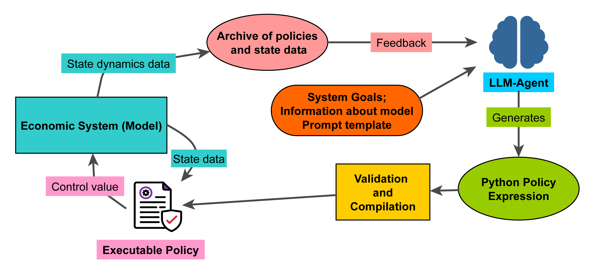

# Creative Governance Simulation (creative-governance-sim)

[](https://opensource.org/licenses/MIT)

A research prototype for studying government agents that use Large Language Models (LLMs) to generate and adapt economic policies.

---



> 🚧 **Идёт большой рефакторинг (2026-06).** Проект мигрировал с Poetry на **uv** и с Gemini на
> **OpenAI-совместимый** движок (любой эндпоинт через `base_url` + `model`). Актуальные инструкции по
> сборке и запуску — в [`AGENTS.md`](AGENTS.md) §4; архитектура и план — в
> [`agents/09-grand-plan.md`](agents/09-grand-plan.md). Команды в разделах ниже частично устарели:
> используйте `uv sync` / `uv run …` (не `poetry`), ключ — `OPENAI_API_KEY`. CLI
> `python -m govsim <эксперимент>` пока не существует (используйте `uv run simulation`).

## О проекте

Цель этого проекта — исследование нового класса агентно-ориентированных моделей. Вместо использования предопределенных правил, управляющий агент (также называемый регентом), в основе которого лежит большая языковая модель (LLM), анализирует состояние симулируемой экономики и генерирует адаптивные политики в виде исполняемого Python-кода.

Исследование сфокусировано на вопросе: может ли такой подход к моделированию найти более эффективные способы оптимизации динамических систем и преодолеть ограничения традиционных методов, основанных на статичных правилах.

### Ключевая концепция

- **Динамическая генерация политик**: Управляющая система генерирует экономические политики в виде Python-выражений на основе текущего экономического контекста.
- **Безопасное исполнение**: Весь сгенерированный код проходит строгую проверку на безопасность через анализ абстрактного синтаксического дерева (AST) перед компиляцией и исполнением.
- **Адаптивное поведение**: Система способна корректировать свои политики в ответ на изменение экономических условий, внешние шоки или новые стратегические цели.

## Быстрый старт

Проект использует [uv](https://docs.astral.sh/uv/) для управления зависимостями.

1.  **Клонируйте репозиторий**
    ```bash
    git clone https://github.com/Hamyrappy/creative-governance-sim.git
    cd creative-governance-sim
    ```
2.  **Установите проект и зависимости**
    ```bash
    uv sync               # добавьте `--group notebook` для jupyter/ipykernel
    ```
3.  **Настройте API-ключ** (только для LLM-регента; базовые эксперименты и тесты работают без ключа)
    - Движок — **OpenAI-совместимый** (любой провайдер / локальная модель / прокси), выбирается
      через `base_url` + `model`, ничего не захардкожено.
    - Создайте файл `.env` в корневой директории проекта:
      ```
      OPENAI_API_KEY="ВАШ_КЛЮЧ"
      OPENAI_BASE_URL="..."   # необязательно: OpenRouter / vLLM / Ollama / прокси
      OPENAI_MODEL="..."      # модель для LLM-регента
      ```

## Запуск эксперимента

Эксперименты запускаются через CLI; имя эксперимента берётся из реестра (`govsim/experiments/`).

```bash
uv run govsim list                       # список доступных экспериментов
uv run govsim run cubic_stabilization    # детерминированный baseline (без ключа)
uv run python -m govsim run cubic_nonlinear --seeds 0 1 2 --horizon 300 --store logs/runs --plot
```

Базовые эксперименты (`cubic_stabilization`, `cubic_nonlinear`, `sir_lockdown`, `company_pricing`)
используют детерминированные/скриптовые регенты и **не требуют API-ключа**. Эксперимент с
LLM-регентом (`cubic_nonlinear_llm`) требует ключ для записи кэша (`cache`-режим) и затем может
воспроизводиться бесплатно/детерминированно через `replay`:

```bash
OPENAI_API_KEY=... OPENAI_MODEL=<модель> uv run govsim run cubic_nonlinear_llm --store logs/runs
GOVSIM_LLM_MODE=replay uv run govsim run cubic_nonlinear_llm --store logs/runs   # без сети
```

Чтобы добавить эксперимент — одна функция + один декоратор `@register` в `govsim/experiments/`.
Результаты (таблица прогонов + ряды метрик + сырой ввод/вывод LLM) сохраняются через `--store` в
`ResultStore` (sqlite + артефакты).


### Архитектура (см. `agents/09-grand-plan.md` — authoritative)

Машина для экспериментов с LLM-«регентами» (контроллерами) над сложными системами; экономика — это
*домен №1*, а не сам каркас. Доменно-нейтральное ядро (`govsim/core/`) — шесть «швов»: `System` /
`ActionInterface` / `Regent` / `Harness` / `Objective` / `Schedule` плюс эксперимент-спайн
(`Experiment`/`Runner`/`ResultStore`) и OpenAI-совместимый `LLMClient` с кэшем/replay-лентой.
Домены живут в `govsim/domains/*` (единственный доменно-связанный шов — `ActionInterface`).

| Где искать | Что |
|---|---|
| Доменно-нейтральное ядро (6 швов + спайн) | `govsim/core/` |
| LLM-клиент (OpenAI-совместимый) + кэш/replay | `govsim/core/llm/` |
| Скалярный домен (cubic / SIR / company, без леджера) | `govsim/domains/scalar/` |
| Регенты (`LLMRegent`, `PIDRegent`, `LQRRegent`) | `govsim/regents/` |
| Компоненты харнесса (`TraceFeedback`, `EpisodicMemory`) | `govsim/harness/` |
| Реестр экспериментов | `govsim/experiments/` |
| WHAT-first гейт-доки (гипотезы / objective / метрика креативности / статистика) | `govsim/docs_gates/` |
| Песочница политик (RestrictedPython) | `govsim/utils/policy_utils.py` → `govsim/core/sandbox.py` |
| Результаты прогонов | директория, переданная в `--store` (по умолчанию ничего не пишется) |

Тесты: `uv run pytest` (всё работает без API-ключа). Планы и анализ — в [`agents/`](agents/).

## License

This project is licensed under the MIT License. See [LICENSE](LICENSE) for details.